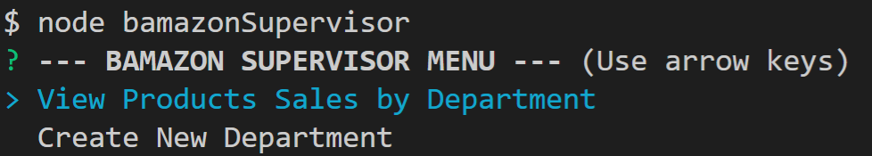
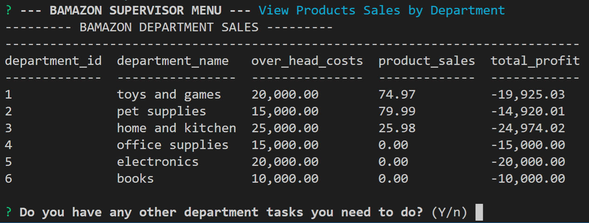

# Bamazon

A CLI shopping app for Bamazon.

## User Instructions

There are three different views on Bamazon for:

- [Customers](#customers)
- [Managers](#managers)
- [Supervisors](#supervisors)

### Customers

1. The Customer View can be accessed through `node bamazonCustomer`.
2. Initially, the customer will be shown all available products on Bamazon.
3. The customer then chooses what product they want to buy by putting in the product ID and the quantity.
4. Once the order goes through, the customer will get a recipt.
5. The customer may then choose to continue shopping or quit the application.

### Managers

1. The Manager View can be accessed through `node bamazonManager`.
2. `View Products for Sale` displays all products available for sale.  
3. `View Low Inventory` displays products which require urgent restocking.  
4. `Add to Inventory` allows the manager to restock items in Bamazon.  
5. `Add New Product` allows the manager to add a new item to Bamazon.  

### Supervisors

1. The Supervisor View can be accessed through `node bamazonSupervisor`.
2. `View Product Sales by Department` displays the product sales for each department. 
3. `Create New Department` allows the supervisor to create a new department.  